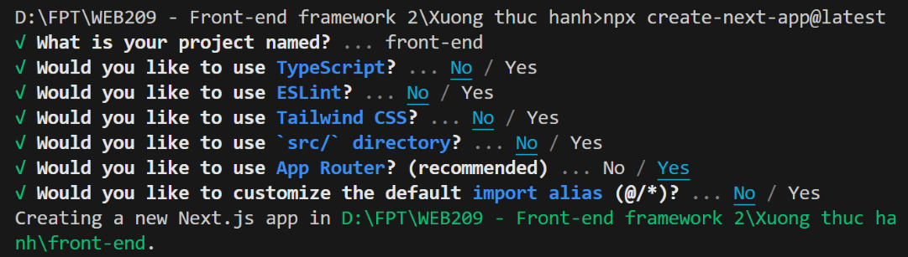
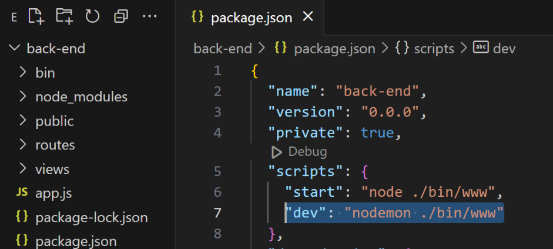
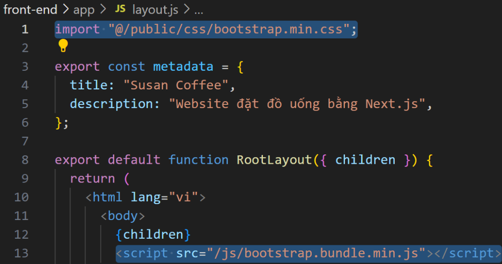

# Websie_Susan_Coffee-
                    XƯỞNG THỰC HÀNH
            Website đặt đồ uống Susan Coffee
        
 + Khởi tạo và cài đặt dự án
 1. Front-end: Next.js
 npx create-next-app@latest
 

 2. Back-end: ExpresJS + MongoDB
  + Cài đặt và cấu hình ExpressJS
    - npm install express --save
    - npm install -g express-generator 
    - express --view=ejs back-end 
    - cd back-end
    - npm install
    - npm audit fix --force
  + Cài Nodemon
    - Cấu hình package.json trong back-endodemon

    + Cài MongoDB Compass
    - https://www.mongodb.com/try/download/community-kubernetes-operator
    + Cài MongoDB
     - npm i mongoose
 3. Tiện ích cho VisualCode
    - Prettier - Code formatter   
    - IntelliSense for CSS class names in HTML 
                                                Thực thi dự án
    1. Từ thư mục back-end dùng lệnh 
        + npm run dev = http://localhost:3000

    2. Từ thư mục front-end dùng lệnh 
        + npm run dev = http://localhost:3001
* Lưu ý: Chạy thư mục back-end trước để tránh trùng port 3000   

                                     Cài đặt Bootstrap
Truy cập các link sau và lưu (Ctrl S) các file vào thư mục front-end/public/css, front-end/public/js tương ứng
 - bootstrap.min.css
 - bootstrap.bundle.min.js
 - Nhúng Bootstrap vào website theo gợi ý sau
 